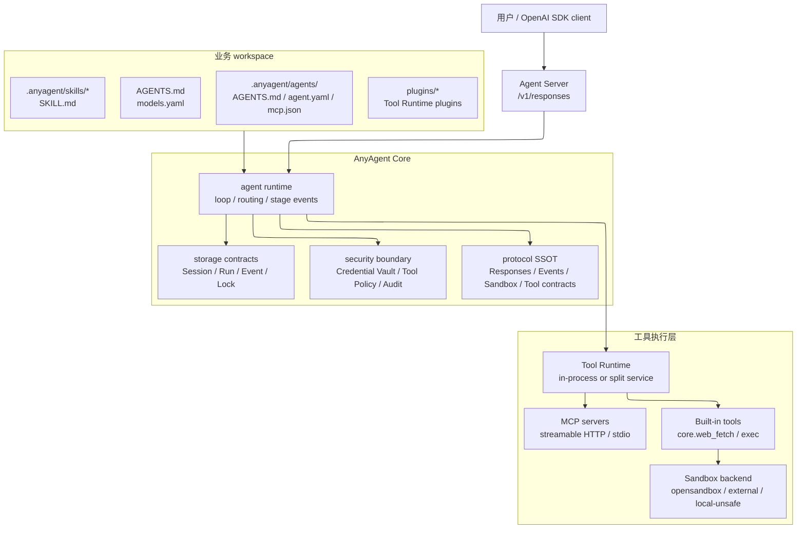
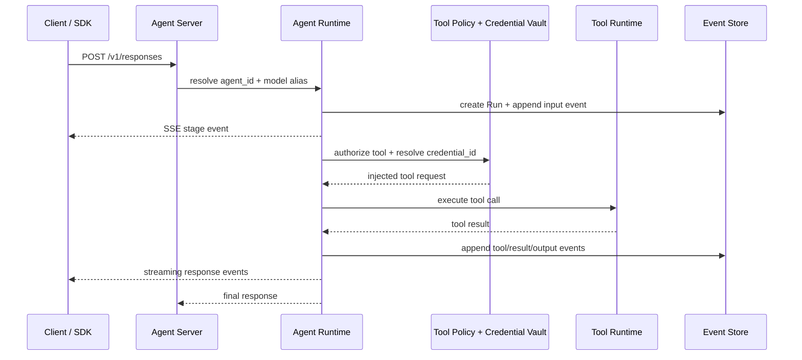
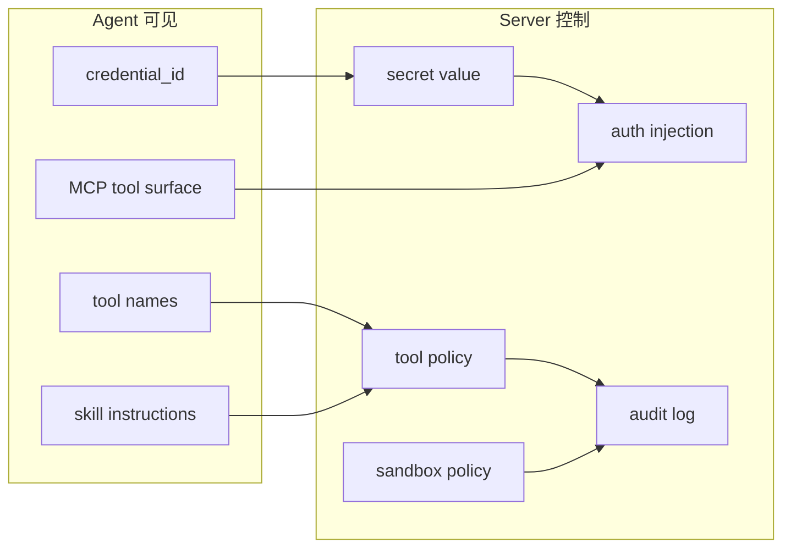

AnyAgent 的核心思路是 **configuration-first Agent infrastructure**：业务仓库声明 agent 的行为、工具和边界，AnyAgent 负责把这些配置变成 OpenAI-compatible 的服务、SDK 事件流和可治理的工具执行。

## 总体分层

## 一次请求如何执行

## 配置、能力与安全边界

<Warning>
  Agent 不应直接持有明文 token、API key 或生产凭据。Agent 看到的是 `credential_id` 和已批准的 tool surface，server 负责解析、注入、审计与隔离。
</Warning>

## 关键设计原则

- **Protocol-first**：公开 API、wire format、事件、SDK 类型和 tool contract 都回到 `anyagent.protocol.*`。
- **Boundary parsing**：HTTP、CLI、SDK、存储、文件和第三方输出进入系统边界时先校验和归一化。
- **Strict boundaries**：配置、协议、runtime、工具执行、凭证和应用示例各有归属，不复制 contract。
- **Gradual disclosure**：默认暴露能力边界和下一步入口，schema、raw tool 和调试细节按需展开。

## 继续阅读

- `/guides/configuration`：workspace、agent pack、models、MCP 与 plugins 如何组织。
- `/guides/agent-server`：本地 runtime、external storage 和 Tool Runtime split。
- `/guides/security-boundaries`：credentials、tool policy、audit 与 sandbox。
- `/reference/architecture-map`：从公开概念跳到源仓真源文档与实现目录。
