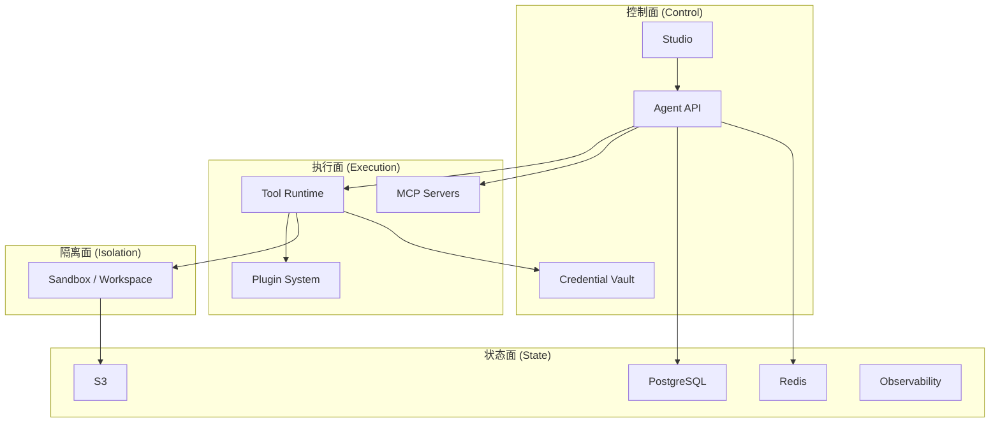
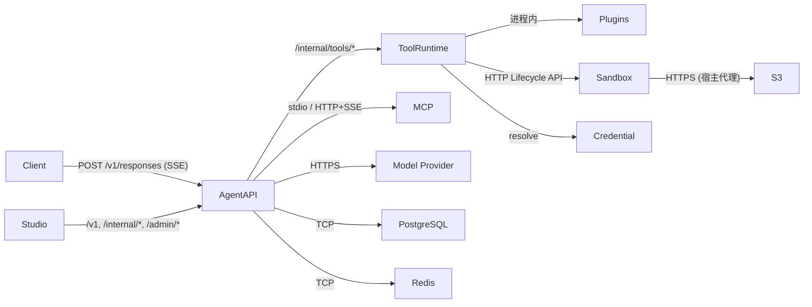
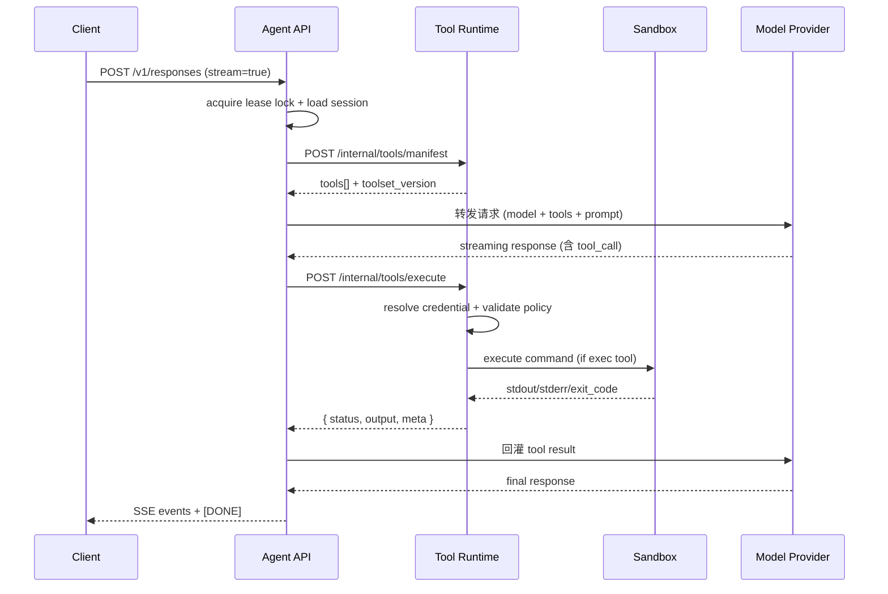

AnyAgent 按 **控制面 / 执行面 / 隔离面 / 状态面** 四个维度划分组件。单进程 all-in-one 与分布式拆分共享同一套 protocol contract。

## 组件总览



---

## 控制面

<AccordionGroup>
  <Accordion title="Agent API — 控制面核心" icon="server">
    **进程命令**: `anyagent serve`（all-in-one）或 `anyagent agent-api serve`（独立）

    **对外端口**: `/v1/responses`、`/internal/*`、`/admin/*`

    职责：
    - 对外提供 OpenAI Responses API 兼容端点
    - Agent Pack 加载（agent.yaml、AGENTS.md、mcp.json）
    - Skills 选择与 prompt context 注入
    - Agent loop 编排：model → tool call → execute → 回灌
    - MCP server 连接管理与工具发现
    - Session / Run / Event 存储写入与查询
    - Observability 事件发射与查询 API
    - 调用 Tool Runtime 执行工具（进程内或远端）
  </Accordion>

  <Accordion title="Studio — 控制面前端" icon="browser">
    **形态**: 静态 SPA，内嵌于 `anyagent serve` 或独立部署

    **消费 API**: `/v1/responses`、`/internal/*`、`/admin/*`

    职责：
    - Agent 会话交互界面
    - Agent catalog 浏览与配置
    - Skills / MCP / Tools 管理与启用
    - Credential 管理（只操作引用，不见明文）
    - Observability 面板：run timeline、event replay
    - Debug 入口：prompt bundle preview、tool manifest 查看

    Studio 是纯 typed API consumer，不读取 server 内部模块，不直接查数据库。
  </Accordion>

  <Accordion title="Credential Vault — 凭证管理" icon="key">
    **接口**: Admin CRUD + read-only resolve

    **后端**: Env / File / Infisical / Database(future) / Vault(future)

    职责：
    - 凭证存储与生命周期管理
    - 将 `credential_id` / `auth_ref` 解析为实际 secret
    - 为 Tool Runtime 和 MCP 连接注入凭证
    - 审计日志：记录凭证访问事件

    Agent 只见 `credential_id`，不见明文。Read API 不回显 secret value。
  </Accordion>
</AccordionGroup>

---

## 执行面

<AccordionGroup>
  <Accordion title="Tool Runtime — 工具执行核心" icon="wrench">
    **进程命令**: `anyagent tool-runtime serve`

    **对外端口**: `/internal/tools/manifest`、`/internal/tools/execute`、`/internal/tools/cancel`

    职责：
    - 工具注册与 manifest 构建（core/app/sandbox/channel 命名空间）
    - 工具执行：接收 Agent API 的 execute 请求，路由到对应 handler
    - 插件加载：从 `TOOL_RUNTIME_PLUGIN_ROOTS` 动态加载插件包
    - Credential resolution：将 `auth_ref` 解析为 handler context 中的 `_credentials`
    - Tool policy enforcement：校验工具调用权限
    - 幂等与去重：基于 `response_id:tool_call_id`
    - Sandbox 工具路由：`exec` 等保留名委托给 Sandbox Runtime
  </Accordion>

  <Accordion title="Plugin System — 工具扩展" icon="puzzle-piece">
    **形态**: `plugins/<plugin-id>/plugin.json` + `plugin.py`

    **加载方**: Tool Runtime

    插件不是独立部署单元，是 Tool Runtime 的扩展包：
    - 注册工具名（如 `reddit.search_posts`）
    - 声明参数 schema 与 credential spec
    - 在 handler 中调用外部 API

    部署方式：
    - 随 workspace 打包：`--plugin-root plugins`
    - 镜像内置：多副本加载同一套插件目录
  </Accordion>

  <Accordion title="MCP Servers — 外部工具源" icon="plug">
    **协议**: stdio / HTTP / SSE / Streamable HTTP

    **管理方**: Agent API（不经过 Tool Runtime）

    连接方式：
    - stdio MCP：Agent API 拉起的 sidecar / 本地子进程
    - HTTP/SSE MCP：独立部署的远程服务

    MCP tools 与 Tool Runtime tools 在 manifest 阶段合并，执行阶段按命名空间路由。凭证通过 MCP credential resolver 注入。
  </Accordion>
</AccordionGroup>

---

## 隔离面

<AccordionGroup>
  <Accordion title="Sandbox / Workspace Runtime" icon="shield">
    **调用方**: Tool Runtime（通过 SandboxManager 路由）

    **后端**: LocalUnsafe / OpenSandbox / External

    职责：
    - 为 `exec` 工具提供命令执行环境（per-session 文件系统隔离）
    - 管理 sandbox 生命周期：创建、执行、快照、休眠、销毁
    - 网络隔离：egress policy 阻止访问内部服务
    - 资源限制：CPU/Memory/Disk 配额

    关键约束：
    - Agent loop 不感知 sandbox 后端，只消费 `exec` tool
    - Sandbox 不挂载凭证，不暴露宿主文件系统
    - per-session sandbox：同 session 内命令共享文件系统
  </Accordion>
</AccordionGroup>

---

## 状态面

<AccordionGroup>
  <Accordion title="Storage Services" icon="database">
    | 逻辑组件 | 职责 | 推荐后端 |
    | --- | --- | --- |
    | Session Store | 会话快照、消息历史、runtime config | PostgreSQL |
    | Run Store | run 元数据与状态机 | PostgreSQL |
    | Event Store | 增量事件日志，支持断线补发 | PostgreSQL |
    | Dedupe Cache | 幂等去重 | Redis + PostgreSQL |
    | Lock Service | 会话内串行租约锁 | Redis |
    | Event Bus | 实时事件广播 | Redis PubSub |
    | Snapshot Store | sandbox workspace 快照 | S3-compatible |

    开发态可全部用 in-memory 替代。外置存储驱动为可选 extras：`anyagent[postgres]`、`anyagent[redis]`。
  </Accordion>

  <Accordion title="Observability / Telemetry" icon="chart-line">
    **内部 API**: `/internal/observability/*`

    **存储**: PostgreSQL `telemetry_events` 表

    职责：
    - Normalized telemetry event 收集与持久化
    - Run timeline 查询
    - Token usage / latency / tool execution 统计
    - 可选 HTTP collector sink 对接外部分析系统
  </Accordion>
</AccordionGroup>

---

## 组件间连接



---

## 部署拓扑

<Tabs>
  <Tab title="本地最小">
    ```bash
    anyagent serve
    ```

    单进程包含所有组件：Agent API + Tool Runtime + Studio + in-memory storage + local sandbox + env credential。

    零外部依赖，适合本地开发和 demo。
  </Tab>

  <Tab title="插件型小生产">
    ```bash
    # 进程 1: Agent API
    anyagent agent-api serve --tool-runtime-url http://tool-runtime:8788

    # 进程 2: Tool Runtime
    anyagent tool-runtime serve --plugin-root plugins --port 8788
    ```

    Agent API 与 Tool Runtime 分进程，可独立扩容。PostgreSQL / Redis 可选。
  </Tab>

  <Tab title="生产级全拓扑">
    ```bash
    # Agent API (N replicas, 无状态)
    # Tool Runtime Pool (M replicas)
    # OpenSandbox (容器隔离)
    # PostgreSQL: runs/sessions/events/telemetry
    # Redis: locks/leases/event bus
    # S3: workspace snapshots
    # Infisical: credential secrets
    ```

    Agent API 无状态多副本，通过 Redis lease 保证会话内串行。Tool Runtime 独立池按工具负载扩容。OpenSandbox 提供真正的命令执行隔离。
  </Tab>
</Tabs>

---

## All-in-One 与分布式的统一性

通过环境变量切换，共享同一套代码路径：

| 关注点 | All-in-One | 分布式 |
| --- | --- | --- |
| Agent API ↔ Tool Runtime | 进程内函数调用 | HTTP `/internal/tools/*` |
| Storage | in-memory adapter | PostgreSQL + Redis |
| Sandbox | LocalUnsafe（本地目录） | OpenSandbox（容器隔离） |
| Credential | EnvBackend | Infisical / Vault |
| MCP | 子进程 stdio | 远程 HTTP/SSE |

关键环境变量：

| 变量 | 作用 |
| --- | --- |
| `TOOL_RUNTIME_BASE_URL` | 设置后 Agent API 通过 HTTP 调用远端 Tool Runtime |
| `STORAGE_MODE` | `memory` / `sqlite` / `postgres+redis` |
| `SANDBOX_BACKEND` | `local-unsafe` / `opensandbox` / `external` |
| `CREDENTIAL_BACKEND` | `env` / `file` / `infisical` |

---

## 一次 tool call 的完整路径



---

## 扩容与隔离策略

| 组件 | 扩容维度 | 隔离边界 |
| --- | --- | --- |
| Agent API | 水平扩容（无状态），Redis lease 保证会话串行 | 租户级 `tenant_id` |
| Tool Runtime | 按工具负载水平扩容，可按命名空间分池 | 进程级 handler 隔离 |
| Sandbox | 按并发 exec 数扩容 | 容器级 per-session 隔离 |
| Storage | PostgreSQL 读写分离 / Redis cluster | `session_partition_key` 分片 |
| MCP Servers | 按 MCP server 类型独立扩容 | 进程级独立服务 |

---

## 继续阅读

<Columns cols={2}>
  <Card title="架构总览" icon="network" href="/concepts/architecture">
    配置层、Server Core、SDK 与安全边界的分层视角。
  </Card>
  <Card title="Agent Server runtime" icon="server" href="/guides/agent-server">
    本地运行、外置存储与 Tool Runtime 拆分。
  </Card>
  <Card title="安全边界" icon="shield-check" href="/guides/security-boundaries">
    Credentials、tool policy、audit 与 sandbox。
  </Card>
  <Card title="架构索引" icon="map" href="/reference/architecture-map">
    从概念跳到源仓真源文档与实现目录。
  </Card>
</Columns>
