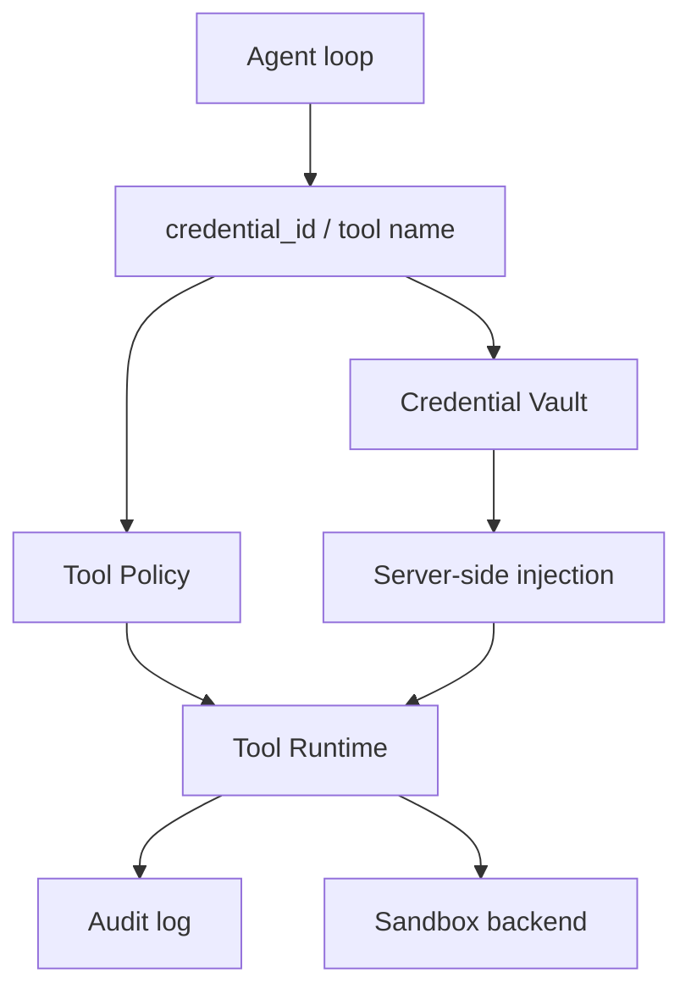

AnyAgent 的默认安全模型是：agent 可以看到资源引用并调用已批准的能力，但 server 拥有 credentials、tool policy、sandbox routing、audit records 和敏感注入逻辑。

## Boundary model

| 边界 | Agent 看到 | Server 控制 |
| --- | --- | --- |
| Credentials | `credential_id` references | Secret resolution and injection |
| MCP servers | Tool surface 和 server names | Auth headers、token format、credential lookup |
| Tools | Approved tool names | Tool policy、runtime routing、audit logging |
| Command execution | 启用后的 `exec` capability | Sandbox backend、session filesystem、egress policy |
| Storage | Stable IDs 和 resumable events | Session、Run、Event、locks、dedupe、retention |

## Sandbox modes

只有 agent 确实需要本地命令执行时，才启用 `exec`。

```yaml
tools:
  requested_tool_names:
    - exec
sandbox:
  mode: "local-unsafe"
```

`local-unsafe` 只适合可信本地开发。生产部署应使用隔离 backend，例如 `opensandbox` 或 `external`。

<Warning>
  只使用 MCP HTTP tools 或 `core.web_fetch` 的 workspace 不需要本地命令执行。除非工作流确实需要，否则保持 sandbox disabled。
</Warning>

## Credential references

Secrets 不进入源码配置。MCP config 应引用 server-side credential：

```json
{
  "auth": {
    "credential_id": "cred_docs_mcp",
    "ref_kind": "bearer_token",
    "injection": "header:Authorization",
    "format": "Bearer {value}"
  }
}
```

## 安全边界图



## Audit 和 policy 真源

详细设计以源仓这些文档为准：

- `docs/security/security-threat-model.md`
- `docs/security/credential-vault.md`
- `docs/security/tool-policy.md`
- `docs/security/audit-logging.md`
- `docs/security/sandbox-security.md`
- `docs/architecture/sandbox-session-filesystem-design.md`
